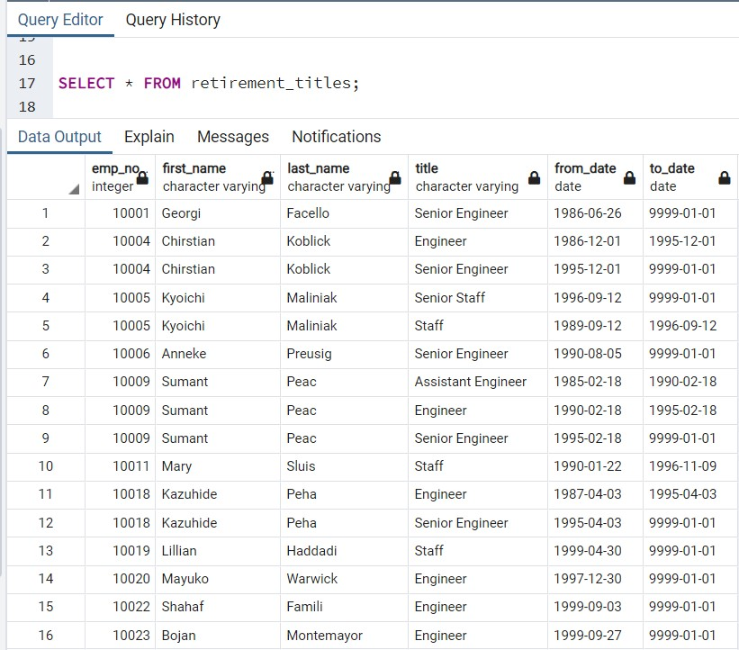
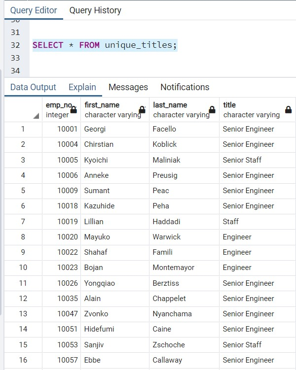
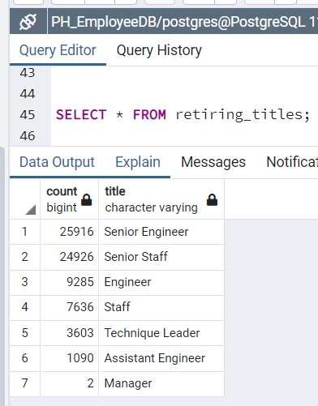
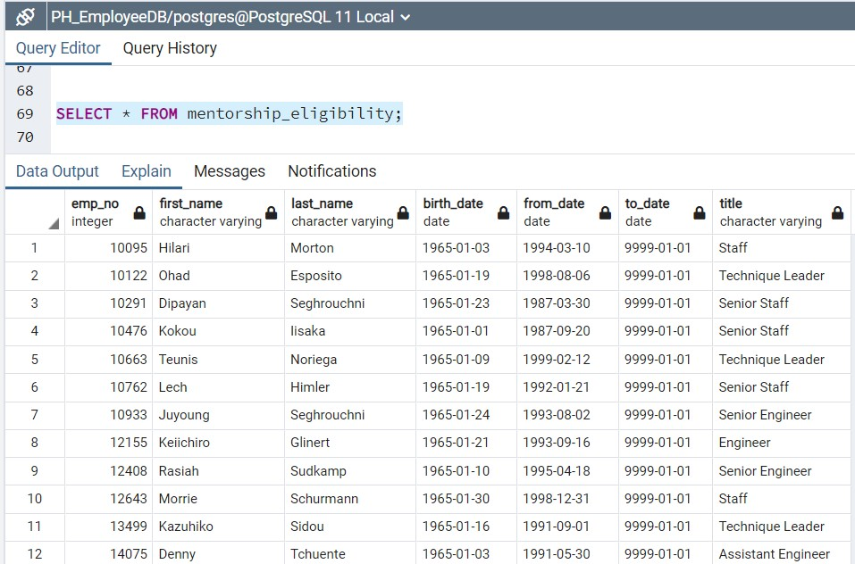

# Pewlett-Hackard-Analysis

## **Overview of the Analysis**
The purpose of this analysis was to analyze the status of upcoming retiring employees. This analysis was broken down into multiple sets of data to display the number of retiring employees by title, by department, and overall number of retiring employees. There was also a request to find the employees who are eligible to be a mentor.

---

## **Results**
     - The first query created resulted in a data set that contained all employees within the employees table that have a birthday between 01-01-1952 and 12-31-1955. 
     

     - The second query used the data above to filter out the employees who are no longer with the company and have a to_date of 01-01-9999. This date causes the data to display only current employees.
     

     -The third query was to perform a count of all upcoming retiring staff per job title.
     

     -The final query finds the employees who are eligibile to be mentors based on birthdate and being a current employee.
     

---

# Summary

     1. The total count of employees who can retire with the silver tsunami is 72,458. This is the total possible number of roles needing to be filled.
     ![alt text] (total_count.jpg)

     2. Based on the count of mentorship eligible employees, there will most likely be an issue with having enough mentors for new employees.
     ![alt text] (mentorship_eligibility_count.jpg)
